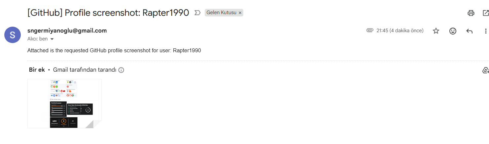
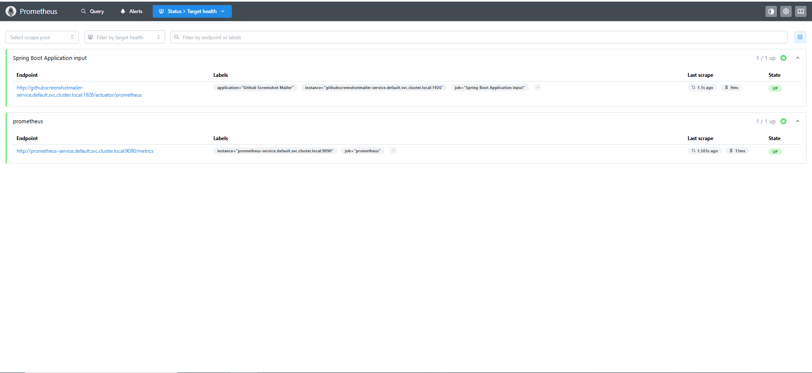

# Case Study - Github Screenshot Mailer

<p align="center">
    
</p>

### 📖 Information

<h3>Project Definition</h3>
<p>
    This service captures a GitHub profile screenshot for a given username, emails the image to a recipient,
    and persists an operation record.
</p>

<h4>End-to-end flow (create API):</h4>
<ul>
  <li>
    Capture <code>https://github.com/{githubUsername}</code>
    (optionally after login if <code>withLogin=true</code>).
  </li>
  <li>Email the PNG to <code>recipientEmail</code>.</li>
  <li>
    Persist a <code>ScreenshotRecord</code> with:
    <code>githubUsername</code>, <code>recipientEmail</code>, <code>fileName</code>,
    <code>filePath</code>, <code>fileSizeBytes</code>, <code>sentAt</code>,
    <code>status (SUCCESS/FAILED)</code>.
  </li>
</ul>

<h4>Optional login:</h4>
<p>
  If <code>withLogin=true</code>, the service signs in with configured credentials and supports
  GitHub Mobile approval (emails the mobile challenge screenshot). If OTP is enforced and cannot be
  switched to Mobile, the request fails with a clear error.
</p>

<h4>Storage layout:</h4>
<p>
  Screenshots are saved in daily directories under the configured base dir
  (<code>GithubAutomationProperties.screenshotDir</code>). Filenames are auto-suggested PNG names
  from the username.
</p>

<h4>Email sending:</h4>
<p>
  Uses <code>JavaMailSender</code>. Failures raise <code>EmailSendException (503)</code>.
</p>

<h4>Search &amp; paging:</h4>
<p>
  A paginated search API lists records with filters (username, email, status, date range,
  file size, filename, keyword).
</p>

### Explore Rest APIs

Endpoints Summary
<table style="width:100%; border-collapse: collapse;">
    <thead>
        <tr style="background-color:#f2f2f2;">
            <th style="border:1px solid #ddd; padding:8px; text-align:left;">Method</th>
            <th style="border:1px solid #ddd; padding:8px; text-align:left;">URL</th>
            <th style="border:1px solid #ddd; padding:8px; text-align:left;">Description</th>
            <th style="border:1px solid #ddd; padding:8px; text-align:left;">Request Body</th>
            <th style="border:1px solid #ddd; padding:8px; text-align:left;">Headers/Path</th>
            <th style="border:1px solid #ddd; padding:8px; text-align:left;">Response</th>
            <th style="border:1px solid #ddd; padding:8px; text-align:left;">Status Codes</th>
        </tr>
    </thead>
    <tbody>
        <tr>
            <td style="border:1px solid #ddd; padding:8px;">POST</td>
            <td style="border:1px solid #ddd; padding:8px;"><code>/api/github-screenshots</code></td>
            <td style="border:1px solid #ddd; padding:8px;">Capture GitHub profile screenshot, email it, and persist a record</td>
            <td style="border:1px solid #ddd; padding:8px;"><code>ScreenshotRequest</code></td>
            <td style="border:1px solid #ddd; padding:8px;">—</td>
            <td style="border:1px solid #ddd; padding:8px;">CustomResponse&lt;ScreenshotResponse&gt;</td>
            <td style="border:1px solid #ddd; padding:8px;">201, 400, 401*, 500</td>
        </tr>
        <tr>
            <td style="border:1px solid #ddd; padding:8px;">POST</td>
            <td style="border:1px solid #ddd; padding:8px;"><code>/api/github-screenshots/search</code></td>
            <td style="border:1px solid #ddd; padding:8px;">Paged listing of screenshot records with filters</td>
            <td style="border:1px solid #ddd; padding:8px;"><code>FilterServicePagingRequest</code></td>
            <td style="border:1px solid #ddd; padding:8px;">—</td>
            <td style="border:1px solid #ddd; padding:8px;">CustomResponse&lt;CustomPagingResponse&lt;ScreenshotResponse&gt;&gt;</td>
            <td style="border:1px solid #ddd; padding:8px;">200, 400</td>
        </tr>
    </tbody>
</table>

### Technologies

---
- Java 21
- Spring Boot 3.0
- Restful API
- Open Api (Swagger)
- Maven
- Junit5
- Mockito
- Integration Tests
- Docker
- Docker Compose
- CI/CD (Github Actions)
- Postman
- Prometheus
- Grafana
- Kubernetes
- JaCoCo (Test Report)
- AOP

### Postman

```
Import postman collection under postman_collection folder
```


### Prerequisites

#### Define Variable in .env file

```
GITHUB_SCREENSHOT_DB_IP=localhost
GITHUB_SCREENSHOT_DB_PORT=3306
DATABASE_USERNAME={MY_SQL_DATABASE_USERNAME}
DATABASE_PASSWORD={MY_SQL_DATABASE_PASSWORD}

GMAIL_ADDRESS={your_gmail_email}
GMAIL_PASSWORD={gmail_authentication_password}

GITHUB_LOGIN_EMAIL={github_login_email}
GITHUB_LOGIN_PASSWORD={github_login_password}
```

### Open Api (Swagger)

```
http://localhost:1926/swagger-ui/index.html
```

---

### JaCoCo (Test Report)

After the command named `mvn clean install` completes, the JaCoCo report will be available at:
```
target/site/jacoco/index.html
```
Navigate to the `target/site/jacoco/` directory.

Open the `index.html` file in your browser to view the detailed coverage report.

---

### Maven, Docker and Kubernetes Running Process


### Maven Run
To build and run the application with `Maven`, please follow the directions shown below;

```sh
$ cd git clone https://github.com/Rapter1990/githubscreenshotmailer.git
$ cd githubscreenshotmailer
$ mvn clean install
$ mvn spring-boot:run
```

---

### Docker Run
The application can be built and run by the `Docker` engine. The `Dockerfile` has multistage build, so you do not need to build and run separately.

Please follow directions shown below in order to build and run the application with Docker Compose file;

```sh
$ cd githubscreenshotmailer
$ docker-compose up -d
```

If you change anything in the project and run it on Docker, you can also use this command shown below

```sh
$ cd githubscreenshotmailer
$ docker-compose up --build
```

To monitor the application, you can use the following tools:

- **Prometheus**:  
  Open in your browser at [http://localhost:9090](http://localhost:9090)  
  Prometheus collects and stores application metrics.

- **Grafana**:  
  Open in your browser at [http://localhost:3000](http://localhost:3000)  
  Grafana provides a dashboard for visualizing the metrics.  
  **Default credentials**:
    - Username: `admin`
    - Password: `admin`

Define prometheus data source url, use this link shown below

```
http://prometheus:9090
```

---

### Kubernetes Run
To run the application, please follow the directions shown below;

- Start Minikube

```sh
$ minikube start
```

- Open Minikube Dashboard

```sh
$ minikube dashboard
```

- Revise `GITHUB_LOGIN_EMAIL` and `GITHUB_LOGIN_PASSWORD` in `github-credentials-secret.yml` and `GMAIL_ADDRESS` and  `GMAIL_PASSWORD` in `gmail-secret.yml` according to your usage


- To deploy the application on Kubernetes, apply the Kubernetes configuration file underneath k8s folder

```sh
$ kubectl apply -f k8s
```

- To open Prometheus, click tunnel url link provided by the command shown below to reach out Prometheus

```sh
minikube service prometheus-service
```

- To open Grafana, click tunnel url link provided by the command shown below to reach out Prometheus

```sh
minikube service grafana-service
```

- Define prometheus data source url, use this link shown below

```
http://prometheus-service.default.svc.cluster.local:9090
```

---
### Docker Image Location

```
https://hub.docker.com/repository/docker/noyandocker/githubscreenshotmailer/general
```

### 📸 Screenshots

<details>
<summary>Click here to show the screenshots of project</summary>
    <p> Figure 1 </p>
    
    <p> Figure 2 </p>
    
    <p> Figure 3 </p>
    
    <p> Figure 4 </p>
    
    <p> Figure 5 </p>
    
    <p> Figure 6 </p>
    
    <p> Figure 7 </p>
    
    <p> Figure 8 </p>
    
    <p> Figure 9 </p>
    
    <p> Figure 10 </p>
    
    <p> Figure 11 </p>
    
    <p> Figure 12 </p>
    
    <p> Figure 13 </p>
    
    <p> Figure 14 </p>
    
    <p> Figure 15 </p>
    
    <p> Figure 16 </p>
    
    <p> Figure 17 </p>
    
    <p> Figure 18 </p>
    
    <p> Figure 19 </p>
    
    <p> Figure 20 </p>
    
    <p> Figure 21 </p>
    
    <p> Figure 22 </p>
    
</details>


### Contributors

- [Sercan Noyan Germiyanoğlu](https://github.com/Rapter1990)